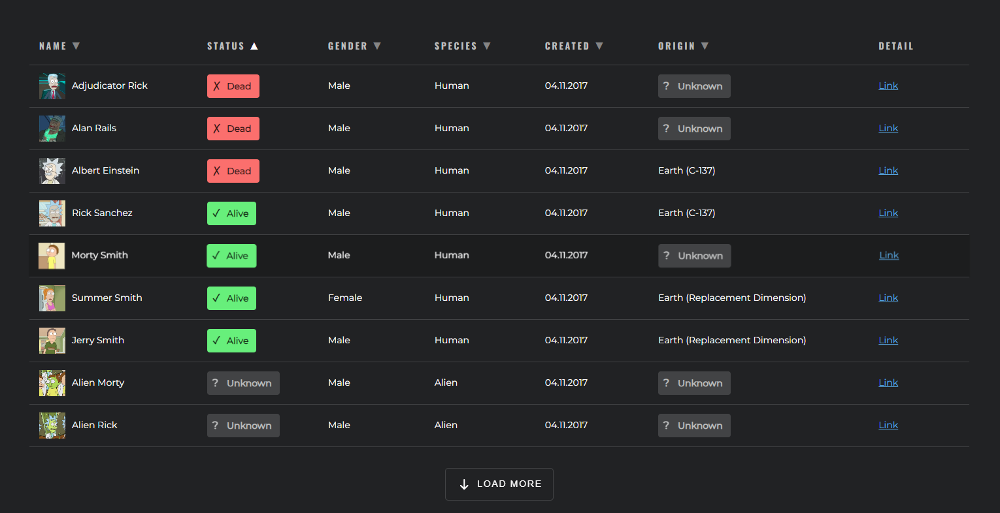
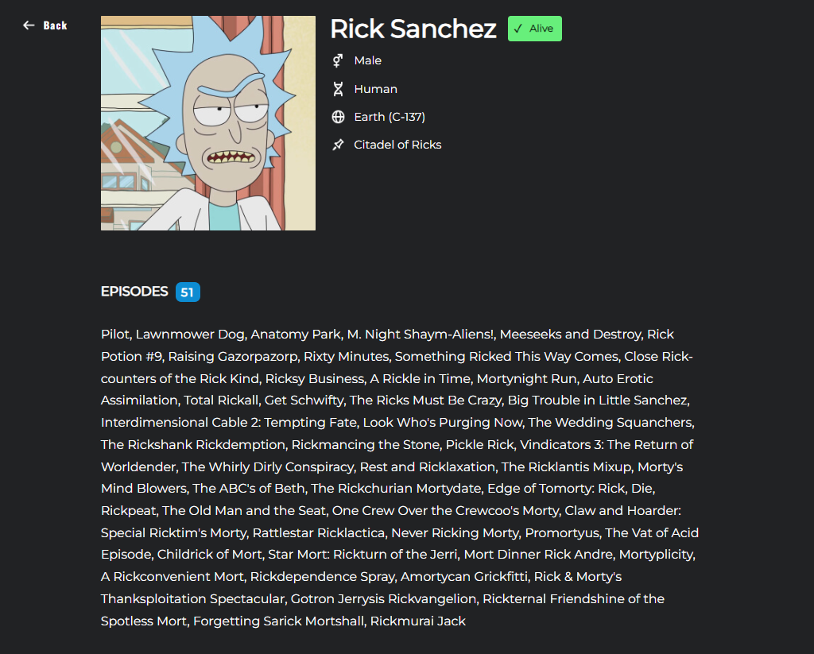
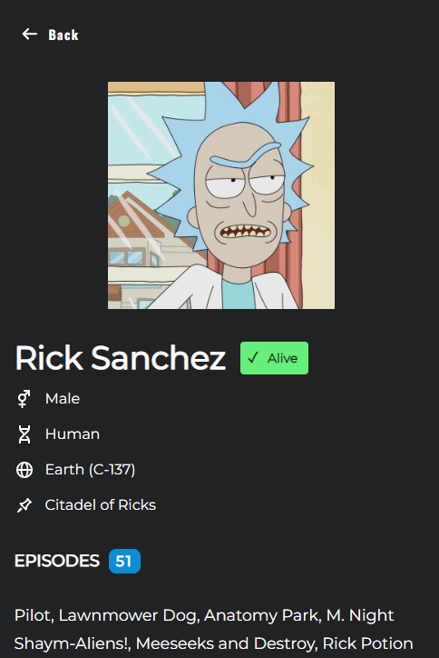

<h1>Rick and Morty Character Table</h1>

<h2>Deployment</h2>

The project is deployed and can be accessed at the following <a href="https://rick-and-morty-table-three.vercel.app/" target="_blank" rel="noopener noreferrer">URL</a>.

<h2>Overview</h2>

    This project is a React application that displays a table of Rick and Morty characters using the 
    <a href="https://rickandmortyapi.com">Rick and Morty API</a>. The application is built with TypeScript 
    and React, incorporating the React Query library for data fetching, React Router for routing, and 
    features responsive design with sorting, and infinite scrolling.

<h2>Technologies Used</h2>
<ul>
    <li><strong>React</strong> - UI library</li>
    <li><strong>TypeScript</strong> - TypeScript for type safety</li>
    <li><strong>React Query</strong> - Data fetching and caching</li>
    <li><strong>React Router</strong> - Routing and navigation</li>
    <li><strong>Axios</strong> - HTTP client for API requests</li>
</ul>

<h3>Dependencies:</h3>
<pre>
<code>
"dependencies": {
    "@tanstack/react-query": "^5.51.23",
    "@testing-library/jest-dom": "^5.17.0",
    "@testing-library/react": "^13.4.0",
    "@testing-library/user-event": "^13.5.0",
    "@types/jest": "^27.5.2",
    "@types/node": "^16.18.105",
    "@types/react": "^18.3.3",
    "@types/react-dom": "^18.3.0",
    "axios": "^1.7.4",
    "react": "^18.3.1",
    "react-dom": "^18.3.1",
    "react-router-dom": "^6.26.0",
    "react-scripts": "5.0.1",
    "typescript": "^4.9.5",
    "web-vitals": "^2.1.4"
}
</code>
</pre>

<h2>Features</h2>

<h3>Main Table Page</h3>
<ul>
    <li><strong>Data Fetching:</strong> Utilizes REST API from <a href="https://rickandmortyapi.com">Rick and Morty API</a>.</li>
    <li><strong>Table:</strong> Displays characters in a table with the following features:
        <ul>
            <li><strong>Sorting:</strong> Click on column headers to sort data in ascending or descending order. An icon indicates the sort direction.</li>
            <li><strong>Responsive Design:</strong> Table adjusts with horizontal scrolling if the width exceeds the viewport.</li>
            <li><strong>Load More Button:</strong> Fetches and displays more rows with each click.</li>
            <li><strong>Row Highlighting:</strong> Rows are highlighted on hover.</li>
            <li><strong>Detail Link:</strong> Click on a character to navigate to a detailed view.</li>
        </ul>
    </li>
</ul>

<h3>Detail Page</h3>
<ul>
    <li><strong>Character Details:</strong> Displays detailed information about the selected character, including:
        <ul>
            <li><strong>Character Image:</strong> A visual representation of the character.</li>
            <li><strong>Episode List:</strong> A list of episodes where the character appeared.</li>
            <li><strong>Tags:</strong> Status tags (alive, dead, unknown) and origin tags.</li>
            <li><strong>Back Button:</strong> Navigates back to the main table page.</li>
        </ul>
    </li>
</ul>

<h2>Screenshots</h2>

<h3>Main Table Page</h3>

Description: Displays the main table of characters with sorting, responsive design, and the load more button. The screenshot also shows sorting by status in ascending order, where characters with the status "Unknown" are always positioned at the bottom, regardless of the sort direction.

<h3>Detail Page</h3>

Description: Shows detailed information of a selected character with image, episodes list, and status tags.

<h3>Detail Page (Mobile version)</h3>

<h2>Code Structure</h2>
<ul>
    <li><strong>Hooks:</strong> Custom hooks for data fetching and state management.</li>
    <li><strong>Components:</strong> Reusable React components for table, rows, and detail views.</li>
    <li><strong>API:</strong> Functions for API requests using Axios.</li>
    <li><strong>Routing:</strong> Configured with React Router for navigation between the table and detail pages.</li>
</ul>
